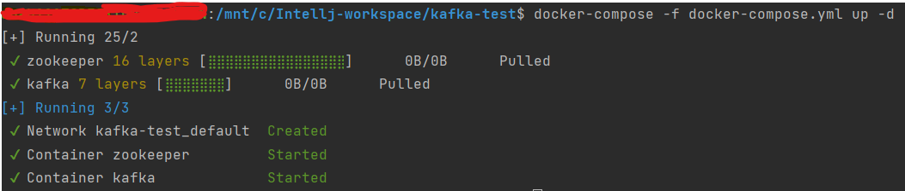

## 1. Docker-Compose.yml 작성

Docker를 사용하여 Kafka, zookeeper를 설치하기 위해
docker-compose파일을 작성한다.

docker-compose.yml

```yml
# docker-compose 버전
version: '3.1'
services:
    # 서비스 명
    zookeeper:
        # 사용할 이미지
        image: wurstmeister/zookeeper
        container_name: zookeeper
        ports:
            - '2181:2181'
    # 서비스 명
    kafka:
        # 사용할 이미지
        image: wurstmeister/kafka
        container_name: kafka
        ports:
            - '9092:9092'
        environment:
            KAFKA_ADVERTISED_HOST_NAME: localhost
            # zookeeper(서비스이름):2181(컨테이너내부포트) 로 대상을 지정
            KAFKA_ZOOKEEPER_CONNECT: zookeeper:2181
# 실행: docker-compose -f docker-compose.yml up -d
```

## 2. 이미지 설치 및 실행

아래의 명령어를 터미널에 실행하여 Docker 이미지를 설치 및 컨테이너를 실행한다.

```
$ docker-compose -f docker-compose.yml up -d
```


